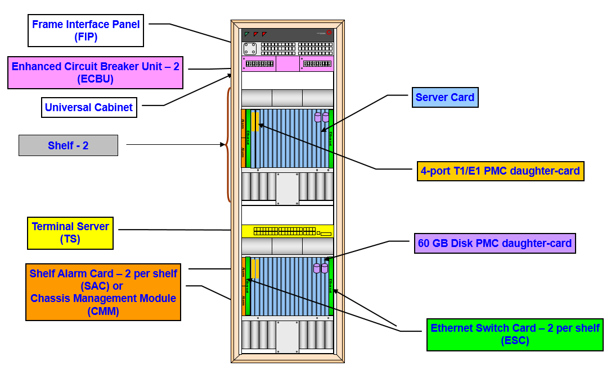
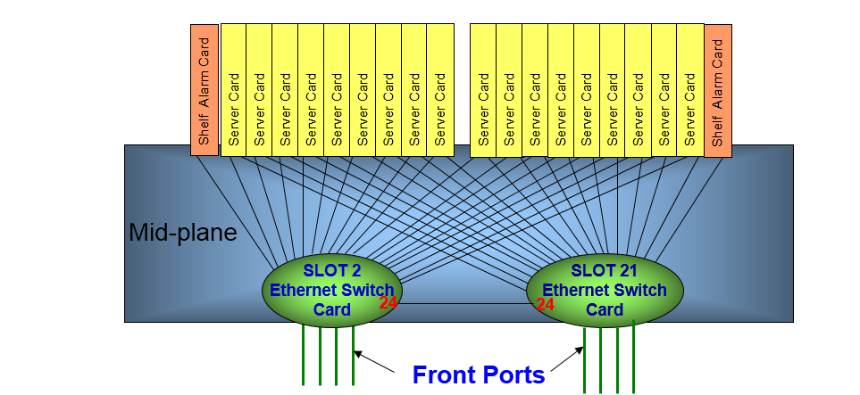

# ipm
Remote IP management module provides a mechanism to detect connectivity status between Host nodes and the ATCAv2 Shelf Management Controller (ShMC).

##
It maintains the route table by deleting the bad route path and adding the good route path to guarantee the current route path in use works well. In some conditions, ShMC will be requested to switched over.

## LCP (Linux Control Platform) Hardware Components

## LCP Dual Ethernet Switch cards

* Each Shelf is equipped with Two Ethernet Switch cards
* Each Server Card has an Ethernet link to the two Ethernet Switch Cards
* Each Alarm Card has an Ethernet link to only one Ethernet Switch Card
* Each ESC Card has 4 1000MB/s ports for Etxthernal communication
* No single point of failure for communication
